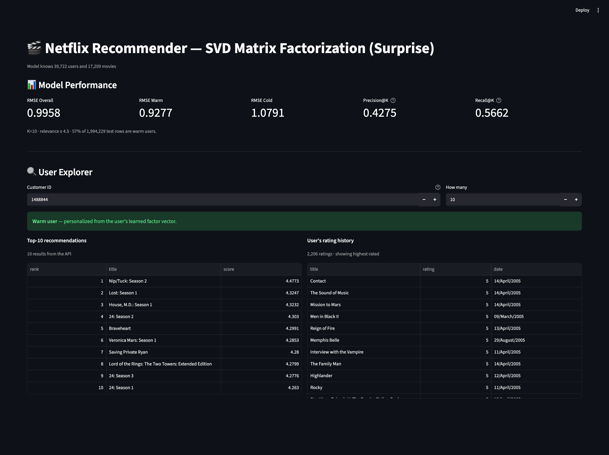
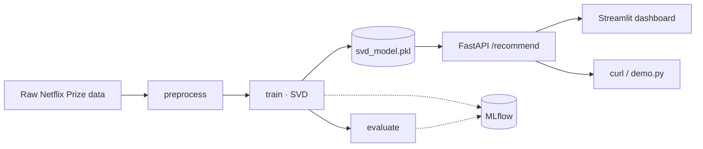

# 🎬 Netflix Movie Recommender — SVD, end to end

A movie recommender on the [Netflix Prize dataset](https://www.kaggle.com/datasets/netflix-inc/netflix-prize-data)
built on Funk matrix factorization (Surprise `SVD`). It covers the full loop: a
reproducible **DVC pipeline** (preprocess → train → evaluate → recommend) and an
online **serving** layer (FastAPI API + Streamlit dashboard), with a pytest suite
and MLflow tracking.

📖 Deep documentation lives in **[docs/](docs/README.md)** (one focused doc per topic).
The forward-looking plan is in **[ROADMAP.md](ROADMAP.md)**.



---

## Architecture

The four-stage **DVC pipeline** turns raw ratings into a fitted model; the **serving**
layer loads that model once and answers recommendations over HTTP. MLflow tracks each
training/evaluation run.

---

## Key decisions
- **SVD over NCF / SVD++.** A PyTorch NCF was tried first; its MLP added only ~1.3% on
  warm users, and SVD++ overfits under a temporal split (its implicit-feedback term
  assumes the test items sit in the user's history, but they are in the future). Plain
  Funk SVD won on simplicity for the same test error.
- **Temporal split, reported warm vs cold.** Ratings are split by date (train on the
  past, predict the future) to avoid a random split's leakage. That creates *cold* users
  whose error is a fixed popularity floor — so every metric is reported overall **and**
  warm-only, and warm is the number worth optimizing.
- **Online serving is a demonstration, not a need.** For a fixed catalog, batch
  precompute is the right tool; the FastAPI layer exists to show the online pattern.
  Stating that plainly is the point.

See [docs/decisions.md](docs/decisions.md) for the full reasoning and numbers.

---

## What's inside
- **Model** — Funk SVD (`scikit-surprise`): `ŷ = μ + b_u + b_i + qᵢ·pᵤ`, scored vectorized over NumPy. See [docs/model.md](docs/model.md).
- **Pipeline** — four DVC stages wired in `dvc.yaml`, params sourced from `config/settings.yaml`. See [docs/pipeline.md](docs/pipeline.md).
- **Serving** — FastAPI (`/recommend/{user_id}`, `/health`) + a Streamlit dashboard that consumes it over HTTP. See [docs/serving.md](docs/serving.md).
- **Tests** — pytest, focused on the vectorized, bug-prone code. See [docs/testing.md](docs/testing.md).
- **Tracking** — MLflow runs (params, train/test RMSE).
- **Containers** — one image; `docker compose up` runs API + dashboard + MLflow.

---

## Quickstart

### 1. Install
```bash
make install-dev      # runtime + dev deps (ruff, pytest, pre-commit)
```

### 2. Get the data
Download the [Netflix Prize dataset](https://www.kaggle.com/datasets/netflix-inc/netflix-prize-data)
from Kaggle and place the files under `data/raw/`:
```
data/raw/
├── combined_data_1.txt
├── combined_data_2.txt
├── combined_data_3.txt
├── combined_data_4.txt
├── movie_titles.csv
└── qualifying.txt
```
`config/settings.yaml` uses all four files (`num_raw_files: 4`); set it to `1` for a quick subset.

### 3. Run the pipeline
```bash
make pipeline         # preprocess -> train -> evaluate -> recommend
# or, with caching + versioning:
dvc repro
```

### 4. Serve it
```bash
make up               # docker compose: API + dashboard + MLflow
```
- API / Swagger → http://localhost:8000/docs
- Dashboard → http://localhost:8501
- MLflow UI → http://localhost:5001

Or run locally without Docker, in two terminals: `make serve` and `make dashboard`.

---

## Project structure
```
.
├── src/                 # pipeline stages: preprocessing · train · evaluate · recommend · model
├── app/                 # api.py (FastAPI) · dashboard.py (Streamlit)
├── examples/            # demo.py — example API client
├── tests/               # pytest suite (conftest + per-module tests)
├── config/              # settings.yaml (all config) · paths.py
├── docs/                # focused per-topic docs (start at docs/README.md)
├── data/ models/ artifacts/ outputs/   # DVC-tracked, not in git
├── dvc.yaml             # the 4-stage pipeline DAG
├── Dockerfile  docker-compose.yml       # serving image + api/dashboard/mlflow stack
├── Makefile             # common tasks — run `make help`
└── ROADMAP.md
```

---

## Results
Trained on a 10% user sample, evaluated on a temporal hold-out (the newest 20% of ratings):

| Metric | Overall | Warm users |
|--------|---------|------------|
| RMSE | 0.9958 | 0.9277 |
| Precision@10 | 0.4275 | 0.3957 |
| Recall@10 | 0.5662 | 0.6390 |

**Baselines for context.** The popularity-only fallback (what cold users get) scores
RMSE 1.0791, so personalization buys ~0.15 RMSE on warm users. For external orientation
only — different split and sample, *not* directly comparable — Netflix's Cinematch scored
≈0.951 and the 2009 grand prize ≈0.857 on their fixed quiz set.

~57% of the ~1.99M test rows are warm. The temporal split (train on the past, predict
the future) sorts test users into two groups:

- **Warm** — seen during training, so they have a learned factor vector and get a
  personalized prediction.
- **Cold** — first appear after the cut-off date, so the model has no history for them
  and falls back to popularity (an error floor no model can beat).

That is why every metric is reported overall **and** warm-only — warm is the number
worth optimizing. The full reading (the relevance threshold behind Precision/Recall@10,
why RMSE and ranking diverge) is in **[docs/evaluation.md](docs/evaluation.md)**; the
modelling decisions (NCF vs SVD vs SVD++, the overfitting analysis) in
**[docs/decisions.md](docs/decisions.md)**.

---

## Development
```bash
make test             # run the pytest suite
make lint             # ruff (no changes)
make format           # ruff format + autofix
```
`pre-commit` runs the linter on commit (`make install-dev` registers the hooks).

---

## License
MIT — see [LICENSE](LICENSE).
